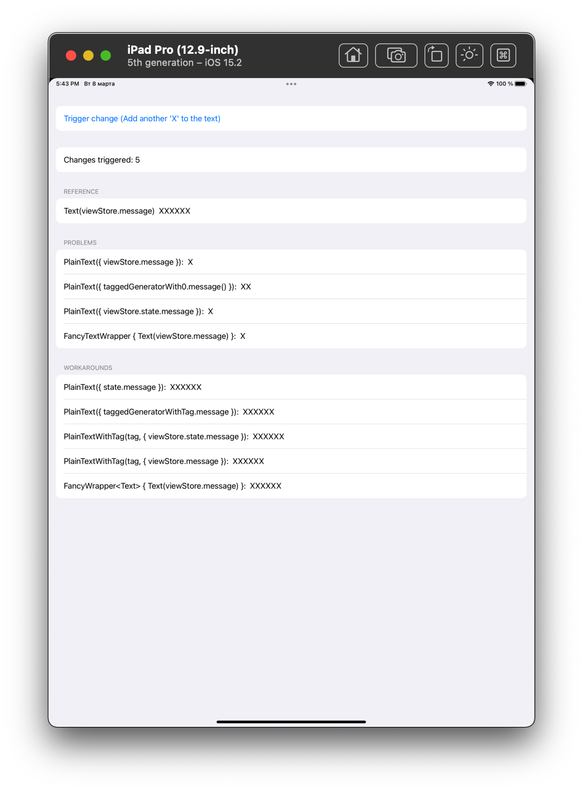

# SwiftUIBodies

A demo of problems/workarounds for Swift UI code that deals with The Composable Architecture and closure-based content generators in child views.

# What

Consider the following example:

```swift
struct PlainText: View {
    let text: () -> String

    var body: some View {
        Text(text())
    }
}

struct ComponentView: View {

    let store: Store<ComponentView.State, ComponentAction>

    struct State: Equatable {
        var message: String
    }

    var body: some View {
        WithViewStore(store) { viewStore in
            PlainText(text: { viewStore.message })
        }
    }
}
```

While it looks innocent (though a bit uneasy due to use of closure to generate the content), it won't trigger updates in the rendered part for PlainText, even though everything is fine from perspective of The Composable Architecture .

The problem lies within the closure and its use as a property in PlainText. The closure captures **only** `viewStore` **reference**, and literally remains the same when state is changed, as `viewStore` is never changed between the invocations. Hence whatever magic exists behind the SwiftUI renderer, it optimizes the corresponding view as not changed, because literally all the values for PlainText are equal in this case, even though the corresponding state is changing (no, mere mortals can't compare closures in Swift, so it's a bit of stretch, though the one that provides the explanation).

One of the known workarounds is to not use `viewStore.xxx` in closures, rather to `let state = viewStore.state` first and use `state.xxx` in closures instead:

```swift
var body: some View {
    WithViewStore(store) { viewStore in
        let state = viewStore.state
        PlainText(text: { state.message })
    }
}
```

Another workaround would be "mirroring" every (state) property used in the closure, as a property of the child view, but it would basically obliterate the usefulness of the closure.

## The app

Run the app, preferably on iPad.

After five changes:



[Log for the above scenario](./SwiftUIBodiesRun.log)


